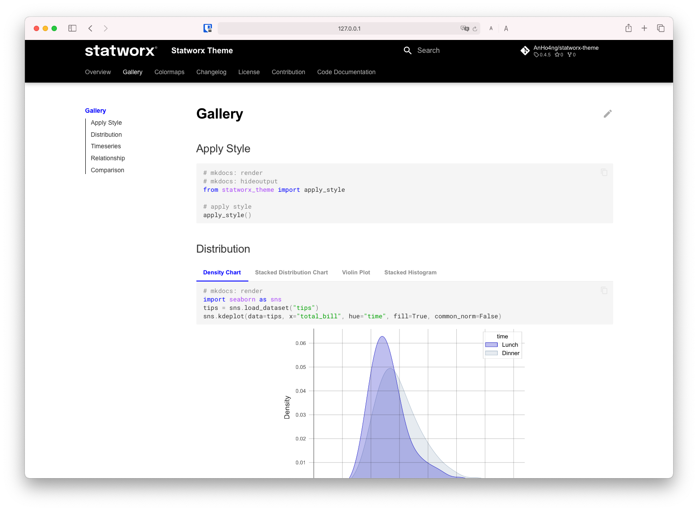

# Statworx Theme

A color theme plugin for the [matplotlib](https://matplotlib.org/) library and all its derivatives, which automatically applies the official statworx color theme.
This package also registers commonly used [color maps](https://matplotlib.org/stable/tutorials/colors/colormaps.html) for use in presentations.

<center>
    
</center>

## Quick Start

Simply install a module with `pip` by using the following command.

```console
pip install statworx-theme
```

To apply the style, you must call the `apply_style` function by typing:

```python
from statworx_theme import apply_style
apply_style()
```

## Gallery

We have an extensive gallery of figures using the statworx theme. You can see them [here](https://statworx-theme.readthedocs.io/en/latest/gallery.html).

<center>
    
</center>
